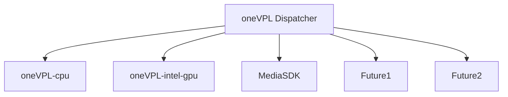

#  Video Processing Library CPU Implementation

The Video Processing Library CPU Implementation is a runtime implementation of oneVPL API for Intel CPUs. It provides video decode, encode, and processing capabilities that run on the CPU.

See the [oneVPL Specification](https://spec.oneapi.io/versions/latest/elements/oneVPL/source/index.html) for additional information. This is part of the [oneAPI specification](https://www.oneapi.io/spec/).

---

**NOTE** Use of this implementation requires installation of the loader provided
as part of the [oneVPL base repository](https://github.com/oneapi-src/oneVPL).

---

## OneVPL Architecture


## CPU Implementation Feature/Color Format Info

This CPU implementation includes the following features:

- H.265/HEVC, H.264/AVC, MPEG2, and MJPEG decode (using libavcodec)
- AV1 decode (using libdav1d and libavcodec)
- MJPEG encode (using libavcodec)
- H.265/HEVC and AV1 encode (using SVT-HEVC, SVT-AV1, and libavcodec)
- H.264/AVC encode (using OpenH264/x264 and libavcodec)
- VPP - Crop, Resize, CSC (using libavfilter/ FFmpeg filters)

Note: H.265/HEVC, H.264, and AV1 are not available in 32-bit builds.

Codecs (+raw frame formats) supported by the CPU software implementation:

|  Codec        |  Encode        | Decode   |
|---------------|----------------|----------|
| MPEG2         |                |8 bit     |
|               |                |4:2:0 only|
| AVC/H.264     |8 bit (OpenH264)|          |
|               |8/10 bit (x264) |8/10 bit  |
|               |4:2:0 only      |4:2:0 only|
| HEVC/H.265    |8/10 bit        |8/10 bit  |
|               |4:2:0 only      |4:2:0 only|
| MJPEG         |8 bit           |8 bit     |
|               |4:2:0 only      |4:2:0 only|
| AV1           |8/10 bit        |8/10 bit  |
|               |4:2:0 only      |4:2:0 only|

Video processing (+raw frame formats) supported by the CPU software implementation:


| Operation     | In formats  | Out formats |
|---------------|-------------|-------------|
| Resize/Crop   | I420, I010  | I420, I010  |
|               | BGRA        | BGRA        |
| Colorspace    | I420, I010  | I420, I010  |
| Conversion    | BGRA        | BGRA        |

Note: I420 = 8 bit/420.  I010=10 bit/420.


## Installation
You can install oneVPL CPU implementation:

- from [oneVPL home page](https://software.intel.com/content/www/us/en/develop/tools/oneapi/components/onevpl.html) as a part of Intel&reg; oneAPI Base Toolkit or standalone.

### Installation from Source
See [Installation from Sources](INSTALL.md) for details.

## Usage

### Configure the Environment

If you install to standard system locations, applications can find the dispatcher library and
the dispatcher's default search rules will find your CPU implementation.

Otherwise you need to set up the environment search paths.  This is easiest to manage when the
install location <vpl-install-location> for oneVPL base is the same directory as used for the
CPU implementation.  In that case you can use the following steps:

For Linux:
```
source <vpl-install-location>/share/oneVPL/env/vars.sh
```

For Windows:
```
<vpl-install-location>\share\oneVPL\env\vars.bat
```

### Run the Command Line Tools

The oneVPL build that you installed as a prerequisite includes command line
tools that use installed implementations. You can use these command line tools
to process video from the command line using the CPU implementation.

All commands below assume `test/content` is the current directory.


- Report implementation capabilities:

    ```
    vpl-inspect
    ```

- Decode an an H.265 encoded video file:

    ```
    sample-decode h265 -i cars_320x240.h265 -o out.i420 -sw
    ```

- Encode a raw video file to H.265:

    ```
    sample-encode h265 -i cars_320x240.i420 -w 320 -h 240 -o out.h265
    ```


## Contributing

See [CONTRIBUTING.md](CONTRIBUTING.md) for more information.

## License

This project is licensed under the MIT License. See the [LICENSE](LICENSE) file
for details.

## Security

See the [Intel Security Center](https://www.intel.com/content/www/us/en/security-center/default.html) for information on how to report a potential
security issue or vulnerability.
